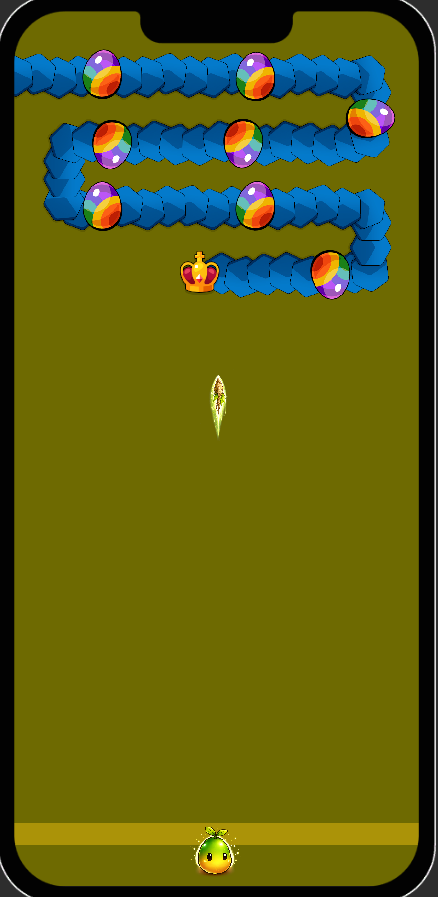
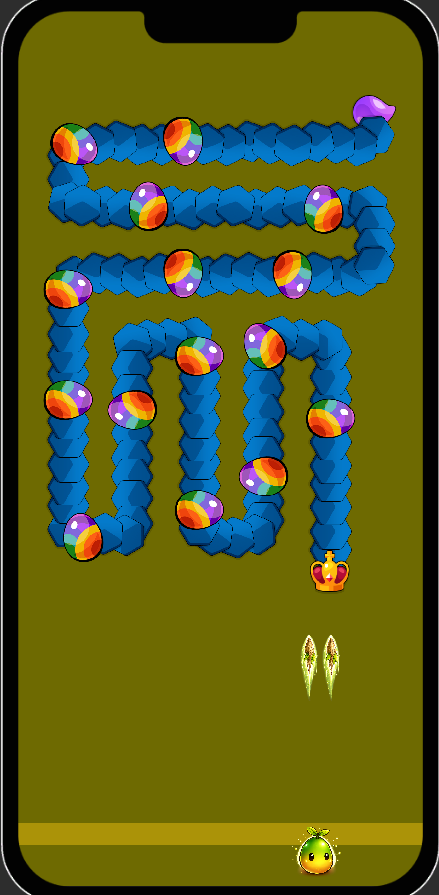
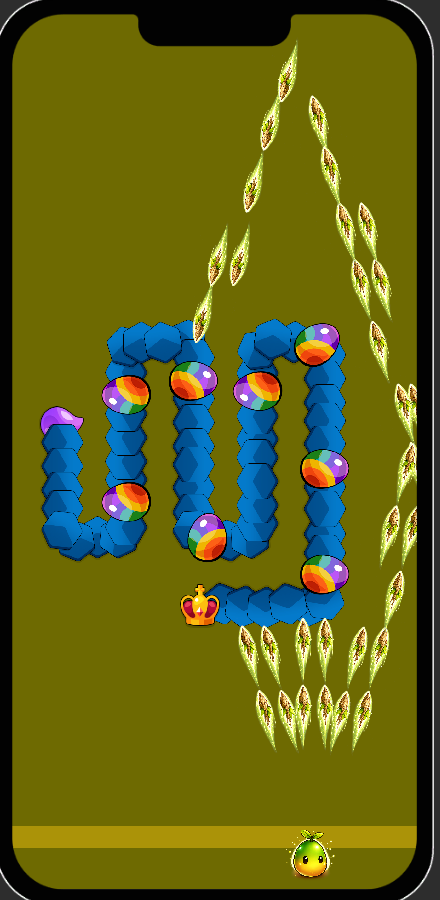

# Force of Nature: Last Seed

A **mobile auto-shooter survival prototype** built in **Unity 6**.

The project focuses on **modular gameplay systems**, **clean architecture**, and a scalable **segmented enemy system** designed for mobile performance.

This repository represents an **in-development gameplay prototype** and serves as a **portfolio project** demonstrating modern Unity architecture practices.

---

## 🚧 Project Status

**Force of Nature: Last Seed is currently in active development.**

The project focuses on building a **clean and scalable gameplay architecture** before expanding content and progression systems.

Planned targets:

* 📱 Google Play
* 🍏 Apple App Store

---

## 🧱 Architecture Goals

The project is being developed with a strong focus on:

* **Single Responsibility Principle (SRP)**
* **Modular gameplay systems**
* Clear separation between **gameplay logic**, **presentation**, and **data**
* Systems designed for **extension without rewriting existing code**

The goal is to maintain a **clean, scalable codebase suitable for production mobile games**.

---

## 🎮 Implemented Gameplay Systems

### Segmented Worm Enemy

* Giant worm composed of **multiple segments**
* Head and tail remain persistent
* Middle segments can be **destroyed individually**
* Worm dynamically **rolls back** when sections are destroyed
* Designed to support long enemy chains with minimal overhead

### Modular Weapon System

* Weapon behaviour defined via **modular components**
* Supports runtime **modifiers and upgrades**
* Clean separation between **weapon logic and projectile logic**

### Projectile Pooling

* Custom **object pooling system**
* Designed to support **multiple weapons simultaneously**
* Prevents runtime allocations during gameplay

### Event-Driven Gameplay

Gameplay systems communicate through **events rather than direct references**, reducing coupling and improving system isolation.

---

## 🧠 Tech & Architecture

* **Unity 6**
* **C#**
* **Object Pooling**
* **ScriptableObjects**
* **Event-driven architecture**
* **Modular gameplay systems**
* Data-driven gameplay configuration

---

## 🧩 Architecture Overview

### Gameplay (Domain)

Core gameplay systems independent from presentation:

* Worm movement and segment logic
* Weapon behaviour
* Projectile systems
* Combat interactions

### Systems (Infrastructure)

Reusable game systems:

* Pool registry
* Spawning systems
* Data configuration
* Event pipelines

### Presentation

Responsible only for visuals:

* Sprite rendering
* VFX
* UI layers

> **Key principle:** gameplay systems remain independent from presentation and UI.

---

## 📂 Project Structure

```
Assets/
  _Project/
    App/
      Gameplay/
        Player/
        Enemy/
        Combat/
      Systems/
        Pooling/
        Input/
      Presentation/
      Bootstrap/
```

The structure is designed to keep **gameplay systems modular and maintainable**.

---

## 📸 Gameplay Screenshots

<p align="center">
  
  
  
</p>

---

## 🎯 Purpose of This Project

This project serves as:

* a **gameplay prototype**
* a **portfolio project demonstrating Unity architecture**
* a sandbox for experimenting with **modular enemy systems**
* a base for a **future mobile game release**

---

## 👨‍💻 Developer

**Oleksandr Tokarev**
Unity & C# Game Developer based in Finland

GitHub: https://github.com/SD7games

---

## License

Source available for **portfolio and educational purposes only**.

You may view and study the source code, but redistribution, commercial use, or publishing the game (or modified versions) is not allowed without written permission from the author.
